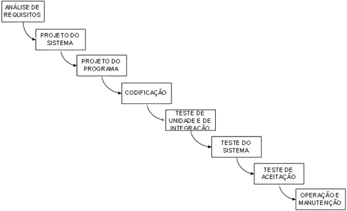

### Cascata
--------------------------------

Formalizado por Royce em 1970, é o modelo mais antigo. Suas atividades fundamentais são:

*   análise e definição de requisitos;
*   projeto;
*   implementação;
*   teste;
*   integração.
  
O modelo em cascata tem o grande mérito de ser o primeiro a impor o planejamento e o [gerenciamento ao processo de software][1] , que antes era casual. O nome "cascata" foi atribuído em razão da sequência das fases, onde cada fase só começa quando a anterior termina; e da transmissão do resultado da fase anterior como entrada para a fase atual (o fim de cada fase resulta em um documento aprovado). Nesse modelo, portanto, é dada muita ênfase às fases de análise e projeto antes de partir para a programação, a fim de que o objetivo do software esteja bem definido e que sejam evitados retrabalhos, conforme podemos observar na **Figura 1**.

Devido à sua simplicidade, o modelo em cascata é fácil de ser entendido pelo cliente. É um modelo que supõe um início e fim claro e determinado, assim como uma estimativa precisa de custo logo no início, fatores importantes na conquista do cliente.

O problema se dá depois, quando o cliente, após esperar até o fim do processo para receber a primeira versão do sistema, pode não concordar com ela. Apesar de cada fase terminar com uma documentação aprovada, certamente haverá lacunas devido a requisitos mal descritos pelo cliente, mal entendido pelo analista ou por mudança de cenário na organização que exija adaptação de requisitos. O modelo em cascata não prevê revisão de fases.

Assim, o risco é muito alto, principalmente para sistemas complexos, de grande porte, afinal o modelo em cascata pressupõe uma realidade estática e bem conhecida, comparado a uma linha de produção fabril. Mas a rotina do negócio do cliente não reflete isso. Manipulação de usuários com diferentes habilidades, ambientes operacionais distintos, tecnologia em crescente evolução, necessidade de integração com outros sistemas (em plataformas antigas ou mais novas), mudanças organizacionais, até mudanças na legislação do município/estado/país, pedem um modelo mais flexível.

Por outro lado, o modelo em cascata adéqua-se bem como um "submodelo" para outros modelos. Por exemplo, no modelo "cascata com realimentação" permite-se que, a cada descoberta da fase posterior, haja uma correção da fase anterior.

[1]: https://www.devmedia.com.br/gestao-de-projetos-de-software/9143 "Gestão de Projetos de Software"