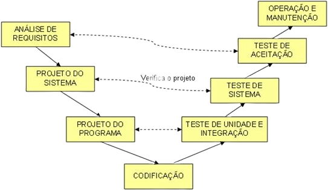

### Modelo em V
--------------------------------

Neste modelo, do Ministério de Defesa da Alemanha, 1992, o modelo em cascata é colocado em forma de "V". Do lado esquerdo do V ficam da análise de requisitos até o projeto, a codificação fica no vértice e os testes, desenvolvimento, implantação e manutenção, à direita, conforme **Figura 1**.

A característica principal desse modelo, que o diferencia do modelo em cascata, é a ênfase dada à verificação e validação: cada fase do lado esquerdo gera um plano de teste a ser executado no lado direito.

Mais tarde, o código fonte será testado, do mais baixo nível ao nível sistêmico para confirmar os resultados, seguindo os respectivos planos de teste: o teste de unidade valida o projeto do programa, o [teste de sistema][1] valida o projeto de sistema e o teste de aceitação do cliente valida a análise de requisitos.

Da mesma forma que o modelo em cascata, o cliente só recebe a primeira [versão do software][2] no final do ciclo, mas apresenta menos risco, devido ao planejamento prévio dos testes nas fases de análise e projeto.

[1]: https://www.devmedia.com.br/guia/tecnicas-e-fundamentos-de-testes-de-software/34403 "Guia de Testes de Software"

[2]: https://www.devmedia.com.br/sistemas-de-controle-de-versao/24574 "O que é Controle de Versão?"