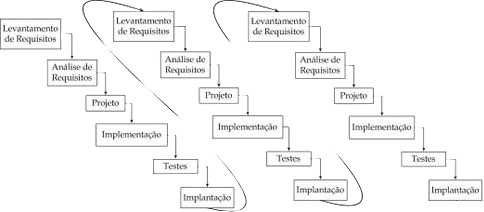

### Ciclos de vida Incremental
--------------------------------

Neste modelo, de Mills em 1980, os requisitos do cliente são obtidos, e, de acordo com a funcionalidade, são agrupados em módulos. Após este agrupamento, a equipe, junto ao cliente, define a prioridade em que cada módulo será desenvolvido, escolha baseada na importância daquela funcionalidade ao negócio do cliente.

Cada módulo passará por todas as fases "cascata" de projeto, conforme se observa na **Figura 1**, e será entregue ao cliente um software operacional. Assim, o cliente receberá parte do produto final em menos tempo.

Como o cliente já trabalhará no primeiro incremento ou módulo, é muito importante que haja uma especial atenção na integração dos incrementos, o que exige muito planejamento, afinal não é aceitável que o cliente se depare com muitos erros de software a cada incremento, tampouco, que a cada incremento ele precise se readaptar a grandes mudanças. Uma atenção especial deve ser dada ao agrupamento dos requisitos e à qualidade no desenvolvimento das funções comuns a todo o sistema, que inevitavelmente deverão ser entregues no primeiro incremento.

Desta forma, além de atender as necessidades mais críticas do cliente mais cedo, as partes mais importantes serão, também, as partes mais testadas no ambiente real. Será mais difícil gastar recursos em conceitos errados, ou que um mau entendimento dos requisitos alcance uma escala difícil de ser ajustada, visto que durante todo o projeto haverá o feedback do cliente (a opinião do cliente realimenta o sistema).

Esse ciclo de vida não exige uma equipe muito grande, pois a modularização diminui o escopo de cada incremento, e não há um paralelismo nas atividades. Haverá, por outro lado, uma dificuldade em manter a documentação de cada fase atualizada devido às melhorias no sistema e aos ajustes de requisitos solicitados pelos clientes.
