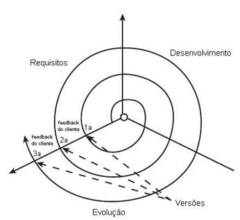

### Modelo Evolutivo
--------------------------------

Neste modelo, os requisitos são adquiridos em paralelo à evolução do sistema. O modelo evolutivo parte do princípio que o cliente não expõe todos os requisitos, ou os requisitos não são tão bem conhecidos, ou os requisitos ainda estão sofrendo mudanças. Desta forma, a análise é feita em cima dos requisitos conseguidos até então, e a primeira versão é entregue ao cliente. O cliente usa o software no seu ambiente operacional, e como feedback, esclarece o que não foi bem entendido e dá mais informações sobre o que precisa e sobre o que deseja (ou seja, mais requisitos).

A partir deste feedback, nova análise, projeto e desenvolvimento são realizados, e uma segunda versão do software é entregue ao cliente que, novamente, retorna com mais feedbacks. Assim, o software vai evoluindo, se tornando mais completo, até atender todas as necessidades do cliente dentro do escopo estabelecido. Tem-se assim a versão final, pelo menos até novos requisitos aparecerem (ver **Figura 1**).

A participação constante do cliente é uma grande vantagem desse modelo, o que diminui o risco de má interpretação de requisitos dos modelos que só oferecem a primeira versão do software no final do processo. Da mesma forma, o software já atende algumas necessidades do cliente muito mais cedo no processo.

Não é dada muita ênfase à documentação, pois a geração de versões torna este trabalho muito árduo. Além disso, como a análise de requisitos e desenvolvimento estão sempre acontecendo, a preocupação em documentar todo o processo pode fazer com que haja atrasos na entrega.

Há uma alta necessidade de gerenciamento nesse tipo de modelo, pois a falta de documentação adequada, o escopo de requisitos não determinado, o software crescendo e estando ao mesmo tempo em produção podem ter consequências negativas. Seguem alguns exemplos: o sistema nunca terminar, pois o cliente sempre pede uma alteração; o sistema não ter uma estrutura robusta a falhas nem propícia a uma fácil manutenção, pelas constantes alterações; o cliente mudar de ideia radicalmente entre uma versão e outra ou revelar um requisito que exija uma versão bem diferente da anterior, fazendo com que toda a base (de dados ou de programação) precise ser revista. Os citados problemas podem implicar em um grande ônus financeiro e de tempo.

É muito importante que o cliente esteja ciente do que se trata este ciclo de vida e que sejam esclarecidos os limites de escopo e de tempo, para que não haja frustrações de expectativas.