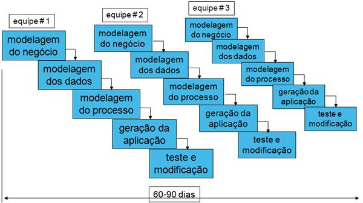

### RAD – “Rapid Application Development”
--------------------------------

Este modelo formalizado por James Martin em 1991, como uma evolução da “prototipagem rápida”, destaca-se pelo desenvolvimento rápido da aplicação. O ciclo de vida é extremamente comprimido, de forma a encontrarem-se exemplos, na literatura, de duração de 60 e 90 dias. É ideal para clientes buscando lançar soluções pioneiras no mercado.

É um ciclo de vida incremental, iterativo, onde é preferível que os requisitos tenham escopo restrito. A diferença principal do ciclo anterior é o forte paralelismo das atividades, requerendo, assim, módulos bastante independentes. Aqui os incrementos são desenvolvidos ao mesmo tempo, por equipes diferentes.

Além do paralelismo, a conquista do baixo tempo se dá graças à compressão da fase de requisitos e da fase de implantação. Isso significa que, na obtenção dos requisitos, costumam-se optar por metodologias mais dinâmicas e rápidas, como workshops ao invés de entrevistas. Permite-se também um desenvolvimento inicial no nível mais alto de abstração dos requisitos visto o envolvimento maior do usuário e visibilidade mais cedo dos protótipos(ver **Figura 1**)

As fábricas de software que resolvem por adotar este modelo devem ter uma estrutura prévia diferencial de pessoas e ferramentas, tais como:

*   Pessoas:

    *   Profissionais experientes (funcional e gerência);
    *   Profissionais de rápida adaptação;
    *   Equipes de colaboração mútua;
    *   Maior quantidade de pessoas;

*   Gerenciamento:

    *   Empresas pouco burocráticas que encorajem a eliminação de obstáculos;
    *   Alto controle do tempo;

*   Uso de Ferramentas:

    *   CASE;
    *   Muita diagramação;
    *   Prévia biblioteca de componentes reutilizáveis (APIs, wizards, templates,...);
    *   Fácil manutenção (ex.: linguagens de programação que suportem Orientação a Objetos, tratamento de exceção, ponteiros);
    *   Adoção de ferramentas maduras, pois não há tempo de atualizar versões e tratar erros inesperados;
  

  Os sistemas desenvolvidos no ciclo RAD tendem a ter uma padronização de telas muito forte, devido a bibliotecas reutilizáveis e templates, porém tendem a perder em desempenho do sistema e na análise de risco (atividades estas que demandam tempo em qualquer projeto). Assim, é preferível seu uso para softwares de distribuição pequena.
