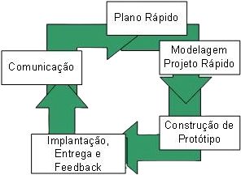

### Prototipagem
--------------------------------

Prototipagem é a construção de um exemplar do que foi entendido dos requisitos capturados do cliente. Pode ser considerado um ciclo de vida ou pode ser usado como ferramenta em outros ciclos de vida.

Um protótipo em engenharia de software pode ser o desenho de uma tela, um software contendo algumas funcionalidades do sistema. São considerados operacionais (quando já podem ser utilizados pelo cliente no ambiente real, ou seja, em produção), ou não operacionais (não estão aptos para serem utilizados em produção). Os protótipos podem ser descartados, ou reaproveitados para evoluírem até a versão final.

No ciclo de vida de prototipagem, não é exigido um conhecimento aprofundado dos requisitos num primeiro momento. Isso é bastante útil quando os requisitos não são totalmente conhecidos, são muitos complexos ou confusos. Desta forma, se o cliente não sabe expressar o que deseja (o que ocorre bastante quando não é um sistema legado), a melhor maneira de evitar que se perca tempo e recursos com uma má interpretação é a construção de modelos, ou seja, de protótipos do que o software faria.

Assim, o cliente experimentará, na prática, como o sistema ou parte dele funcionará. A partir desse primeiro contato, o cliente esclarece o que não foi bem interpretado, aprofunda alguns conceitos e até descobre um pouco mais sobre o que realmente precisa. A partir deste feedback, novos requisitos são colhidos e o projeto ganha maior profundidade. Outro protótipo é gerado e apresentado ao cliente, que retorna com mais feedbacks. Ou seja, o cliente participa ativamente do início ao fim do processo (ver **Figura 1**)

A geração de protótipos pode ser facilitada por ferramentas geradoras de telas, de relatórios, poupando esforço de programação e diminuindo o tempo de entrega.

Cada protótipo tem uma finalidade diferente. Um protótipo pode servir para esclarecer dúvidas sobre uma rotina, demonstrar a aparência das telas, conteúdo de tabelas, formato de relatórios. Os protótipos podem também ser utilizados para apresentar opções ao cliente para que ele escolha a que mais lhe agrade, como opções de navegação, de fluxo de telas, entre outras.

Por isso, é muito importante explicar previamente ao cliente que protótipos são apenas modelos para melhorar a comunicação. Caso contrário, pode causar uma frustração por não funcionar corretamente, ter funções limitadas, ter resposta lenta, ou a aparência ruim. Certamente um protótipo construído para esclarecer uma rotina provavelmente terá uma “cara feia”; para demonstrar a aparência das telas, não terá funcionalidade; para apresentar o formato dos relatórios, os dados não serão coerentes.

O cliente fará comparações entre o sistema final e o que foi “prometido” através do protótipo e pode ficar insatisfeito. Por exemplo, geralmente o protótipo não acessa rede ou banco de dados, pois as informações são “desenhadas” com a tela, fazendo com que tudo fique muito rápido. Já no ambiente operacional haverá uma degradação de desempenho e o cliente pode se decepcionar.

Faz parte de um bom gerenciamento no modelo de prototipagem planejar se, quais e que funções dos protótipos não operacionais serão reaproveitadas na versão operacional, para que sua confecção siga as [boas práticas de engenharia de software][1]. Os protótipos não operacionais são construídos com pouca qualidade em prol da velocidade. Ou seja, não há preocupação na programação, em refinar o código, em usar comentários, em aproveitar eficientemente os recursos de hardware e software, na manutenção, no reuso de componentes e na integração com outras funções ou sistemas. Com certeza será um problema se a equipe sucumbir à pressão do cliente, cada vez mais ansioso para ver a versão final daquele trabalho, e transformar à revelia, protótipos não operacionais em operacionais.

O gerente também deve se preocupar com o escopo do projeto versus a quantidade de protótipos, para que não se perca muito tempo nesse processo, tampouco se transforme num processo de “tentativa e erro”.

Não é uma tarefa fácil documentar o modelo de ciclo de vida baseado na prototipagem devido aos requisitos não serem totalmente conhecidos no primeiro momento e a consequente quantidade de mudanças ocorridas.

[1]: https://www.devmedia.com.br/principios-da-engenharia-de-software/29630 "Princípios da Engenharia de Software"