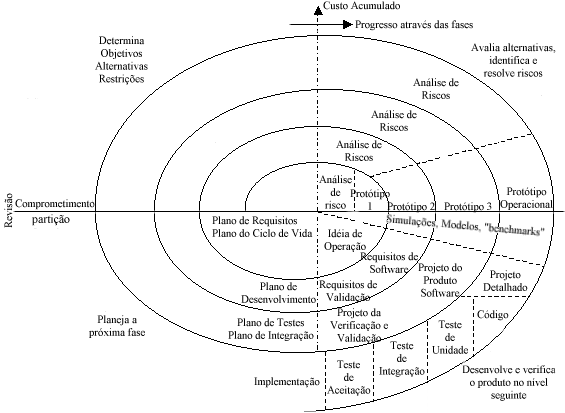

### Modelo Espiral
--------------------------------

O modelo proposto por Boehm em 1988 trata de uma abordagem cíclica das fases do processo, onde a cada “volta” ou iteração temos versões evolucionárias do sistema.

Este é um modelo guiado por risco, suporta sistemas complexos e/ou de grande porte, onde falhas não são toleráveis. Para isso, a cada iteração há uma atividade dedicada à análise de riscos e apoiada através de geração de protótipos, não necessariamente operacionais (desenhos de tela, por exemplo) para que haja um envolvimento constante do cliente nas decisões.

Cada iteração ou volta é dedicada a uma fase do processo de vida de um software (viabilidade do projeto, definição de requisitos, desenvolvimento e teste,...). Ao mesmo tempo, cada volta é seccionada em 4 setores, da seguinte forma:

1.  Iteração: Viabilidade do projeto:

    *   1.1. Definição de objetivos;
    *   1.2. Avaliação e redução de riscos;
    *   1.3. Desenvolvimento e validação;
    *   1.4. Planejamento da próxima fase;

2.  Iteração: Definição de requisitos do sistema:

    *   2.1. Definição dos objetivos;
    *   2.2. Avaliação e redução de riscos;
    *   2.3. Desenvolvimento e validação;
    *   2.4. Planejamento da próxima fase;

3.  Iteração: Projeto do sistema:

    *   3.1. ...
    *   3.2. ...
    *   ...
  

4.  Iteração: Desenvolvimento e teste de unidade

    *   4.1. ...
    *   4.2. ...
    *   ...

5.  Iteração: Implantação

    *   ...
  

 Ou, na representação gráfica deste modelo conforme **Figura 1**

Os quatro setores são explicados da seguinte forma:

1.  Na Definição de Objetivos, desempenhos, funcionalidade, entre outros objetivos, são levantados. Visando alcançar esses objetivos são listadas alternativas e restrições, e cria-se um plano gerencial detalhado.
2.  Na Análise de Riscos, as alternativas, restrições e riscos anteriormente levantados são avaliados. Neste setor (porém não apenas neste) protótipos são utilizados para ajudar na análise de riscos.
3.  No Desenvolvimento e Validação um modelo apropriado para o desenvolvimento do sistema é escolhido, de acordo com o risco analisado no setor anterior (cascata, interativo,...).
4.  No Planejamento da Próxima fase ocorre a revisão do projeto e a decisão de partir para a próxima fase.

Ou seja, cada volta ou iteração do processo é vista por quatro ângulos.

No final da Viabilidade do Projeto teremos como resultado a Concepção das Operações; da Definição de Requisitos o produto serão os requisitos; no final do Desenvolvimento e Testes o projeto é criado e os testes habilitados. Pode-se parar por aí, pode-se incluir mais fases, pode a espiral ficar adormecida até uma nova alteração do sistema se requisitada, e desta forma estender até o fim de vida do sistema.

Neste modelo, apenas o início é definido. A evolução e amadurecimento dos requisitos demandam tempo ajustável (assim como custo). Isto torna o sistema difícil de ser vender ao cliente e exige um alto nível de gerenciamento em todo o processo.