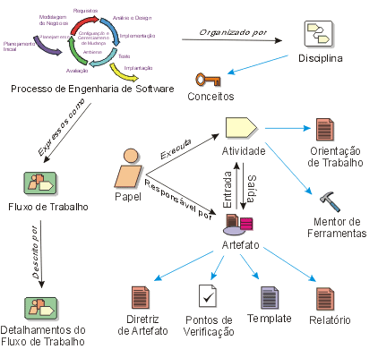
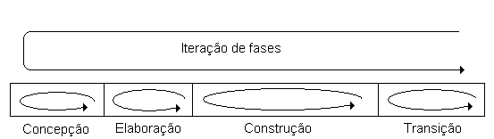
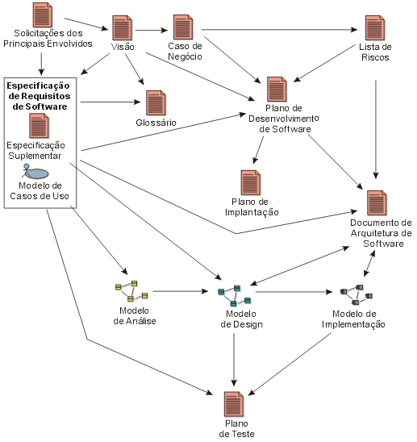

### Modelo de Ciclo de Vida Associado ao RUP
--------------------------------

Derivado [da UML][1] e do Processo Unificado de Desenvolvimento de Software, o RUP, Rational Unified Process, é um modelo de processo iterativo e incremental, dividido em fases, orientado a casos de uso. Possui framework (esqueleto) de processo e manuais que guiam na utilização das melhores práticas de especificação de projeto (Vídeo Aula sobre Ciclo de Vida de Software, parte 3, revista Engenharia de Software Magazine).

O objetivo do RUP é produzir software com qualidade (melhores práticas de engenharia de software) que satisfaça as necessidades dos clientes dentro de um prazo e orçamento estabelecidos.

Este modelo foi desenvolvido pela Rational Software Corporation e adquirido pela IBM, que o define da seguinte maneira: “IBM Rational Unified Process®, ou RUP, é uma plataforma de processo de desenvolvimento de software configurável que oferece melhores práticas comprovadas e uma arquitetura configurável (ver **Figura 1**)

*   Concepção: define o escopo do projeto, ou “business case”; onde é julgado se o projeto deve ir adiante ou ser cancelado.
*   Elaboração: elabora [modelo de requisitos][2], arquitetura do sistema, plano de [desenvolvimento para o software][3] e identificar os riscos.
*   Construção: constrói o software e a documentação associada.
*   Transição: finaliza produto, define-se plano de entrega e entrega a versão operacional documentada para o cliente.

A iteração no RUP tem por objetivo minimizar os riscos. Como pode ser visto na **Figura 2**, a iteração pode acontecer dentro de cada fase, gerando incrementos, ou em todo o processo. Por exemplo, dentro da concepção, a iteração pode ocorrer até que todos os requisitos sejam perfeitamente entendidos. O plano de iterações identificará quais e quantas iterações são necessárias durante o processo.   

Em geral, essas fases demandam esforço e programação diferentes. Para um projeto de médio porte, de acordo com o fabricante será seguida a distribuição apresentada na **Tabela 1**.

|                | Concepção | Elaboração | Construção | Transição |
|----------------|-----------|------------|------------|-----------|
| Esforço        | ~5%       | 20%        | 65%        | 10%       |
| Programação    | 10%       | 30%        | 50%        | 10%       |

**Tabela 1**. Distribuição prevista de esforço e programação para um ciclo de desenvolvimento inicial típico de um projeto de médio tamanho

|                | Concepção | Elaboração | Construção | Transição |
|----------------|-----------|------------|------------|-----------|
| Esforço        | ~5%       | 20%        | 65%        | 10%       |
| Programação    | 10%       | 30%        | 50%        | 10%       |

**Tabela 1**. Distribuição prevista de esforço e programação para um ciclo de desenvolvimento inicial típico de um projeto de médio tamanho

O RUP usa templates que descrevem o que é esperado no resultado de cada fase ou cada iteração (IBM, 2004), identificando as competências e responsabilidades (arquiteto, analista, testador,...), as atividades e os artefatos.

Para descrever as atividades (codificação de uma classe, integração de sistemas,...) o RUP faz o uso de manuais (guidelines), que descrevem técnicas e heurísticas; e de “Mentores de Ferramentas”, que explicam o uso da ferramenta para executar a atividade. Os artefatos de cada fase (documentos, modelos, códigos, etc.) são criados, juntamente com templates e exemplos, para melhor entendimento da equipe e do cliente (ver **Figura 3**)

Os templates também ajudam no gerenciamento, pois definem o que precisa ser executado. Servem também como guia para que as boas práticas de especificação de projeto não sejam esquecidas no processo de desenvolvimento daquele software.

Assim, toda a preocupação dada pelo RUP em disciplinar o processo através de frameworks, guias, templates, faz com que haja uma melhor alocação de pessoas na equipe, padronização do sistema, visão concreta do andamento do projeto.

A escolha do RUP deve ser feita por empresas de software com prévia experiência, pois a definição de framework, templates, guias, métodos, entre outros, demandam tempo e exigem aderência às boas práticas de processo de software.

[1]: https://www.devmedia.com.br/como-trabalhar-com-uml-na-pratica/33425 "O que é UML?"

[2]: https://www.devmedia.com.br/entendendo-os-requisitos-de-software-revista-net-magazine-97/24715 "Entendendo os Requisitos de Software"

[3]: https://www.devmedia.com.br/atividades-basicas-ao-processo-de-desenvolvimento-de-software/5413 "Atividades básicas ao processo de desenvolvimento de Software"