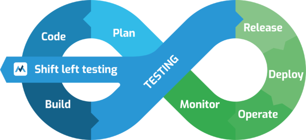
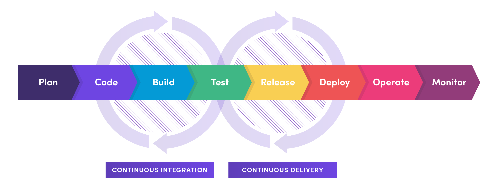
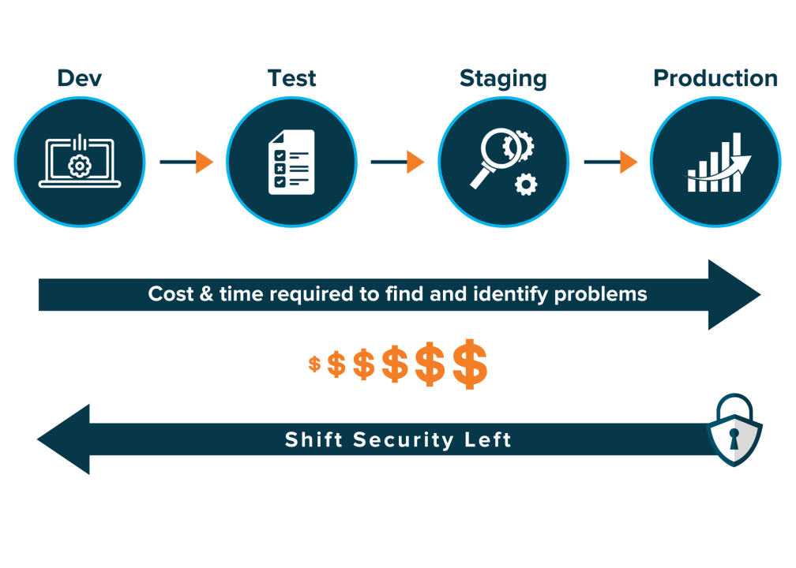
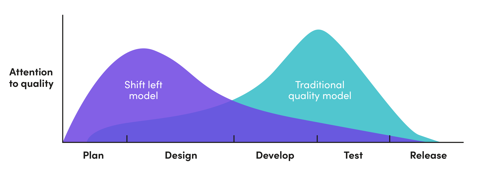
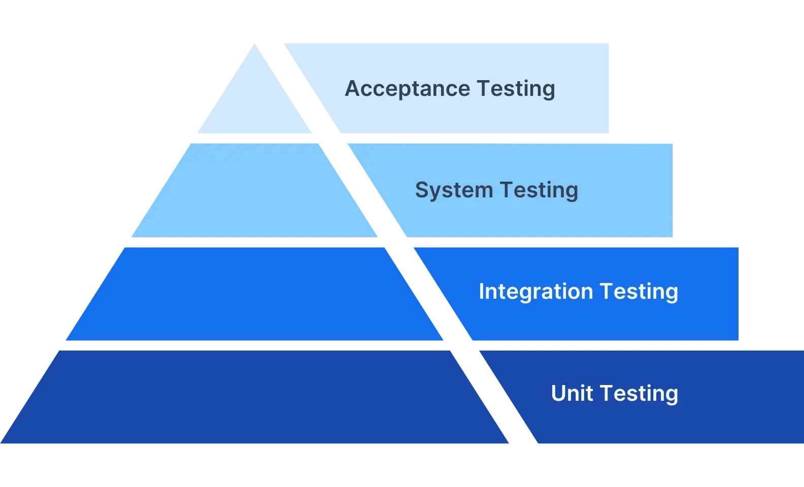

# **Shift Left 

O desenvolvimento de software moderno exige velocidade, qualidade e colaboração contínua entre equipes. Nesse contexto, o **DevOps** surgiu como uma abordagem para integrar equipes de desenvolvimento (Dev) e operações (Ops), promovendo a automação e a melhoria contínua ao longo do ciclo de vida do software.

Dentro desse ecossistema, um dos conceitos mais relevantes é o **Shift Left** — uma filosofia que incentiva a antecipação de atividades críticas, como testes, segurança e validações, para as fases iniciais do desenvolvimento. Neste artigo, vamos explorar o conceito de Shift Left, seus benefícios e exemplos práticos de como ele pode ser implementado.

---

## **O que é Shift Left?**

**Shift Left** é uma abordagem que propõe a **antecipação de atividades tradicionalmente realizadas nas etapas finais do ciclo de vida do software** — como testes, revisões de segurança e validações de desempenho — para fases mais iniciais, ou seja, mais à "esquerda" no fluxo de desenvolvimento.

O termo “left” (esquerda) vem da visualização típica de um pipeline de desenvolvimento, onde a linha do tempo é lida da esquerda para a direita: planejamento → desenvolvimento → testes → implantação → manutenção. Ao mover certos processos para a esquerda, antecipamos a detecção de problemas, tornando o ciclo de desenvolvimento mais eficiente e com menor custo de correção.

---

## **Por que o Shift Left é importante em DevOps?**

No contexto de DevOps, onde o objetivo é integrar qualidade e agilidade, o Shift Left é essencial para:

* Reduzir retrabalho e falhas em produção.
* Detectar defeitos mais cedo e a um custo menor.
* Tornar a entrega contínua mais segura e confiável.
* Aumentar a colaboração entre equipes multifuncionais.
* Promover uma cultura de **qualidade desde o início (quality-first mindset)**.

---

## **Benefícios do Shift Left**

### 1. **Detecção precoce de bugs**

Problemas detectados no início do desenvolvimento são mais fáceis e baratos de resolver. Segundo estudos da IBM, **o custo de correção de um bug em produção pode ser até 100 vezes maior** do que na fase de codificação.

### 2. **Maior qualidade do software**

Com testes e validações antecipadas, há maior cobertura de casos e prevenção de falhas antes da entrega ao cliente.

### 3. **Entrega mais rápida**

Ao reduzir o tempo gasto em correções tardias, o ciclo de entrega (time-to-market) diminui significativamente.

### 4. **Automação e eficiência**

O Shift Left incentiva a automação de testes, segurança e validações, otimizando o pipeline de CI/CD.

### 5. **Melhoria na colaboração entre times**

Desenvolvedores, QA, SREs e profissionais de segurança trabalham juntos desde o início, promovendo uma cultura de responsabilidade compartilhada.

---

## **Exemplos de Aplicação do Shift Left**

### **1. Testes Automatizados desde o Início**

Em vez de deixar os testes apenas para o final, a equipe implementa **testes unitários e de integração** já nas fases iniciais de codificação, integrando-os ao pipeline de CI (Integração Contínua). Ferramentas como **JUnit, pytest, Jest** e **Selenium** são amplamente utilizadas.

### **2. Integração Contínua (CI)**

O uso de ferramentas como **Jenkins, GitHub Actions ou GitLab CI/CD** permite a execução automática de testes a cada push no repositório, garantindo que falhas sejam detectadas imediatamente.

### **3. Segurança (DevSecOps)**

A abordagem Shift Left também se aplica à segurança: ferramentas como **SonarQube, Snyk ou Checkmarx** fazem análise de código estático (SAST) durante o desenvolvimento, identificando vulnerabilidades desde o início.

### **4. Testes de performance antecipados**

Utilizar ferramentas como **JMeter ou Gatling** para validar a performance já durante a fase de desenvolvimento evita surpresas em produção.

### **5. Validação de requisitos com BDD (Behavior Driven Development)**

A prática de escrever cenários de testes com linguagem natural (ex: Gherkin) permite validar requisitos desde a fase de planejamento, integrando testes automatizados com ferramentas como **Cucumber**.

---

## **Desafios na implementação do Shift Left**

Apesar dos benefícios, o Shift Left também apresenta alguns desafios:

* **Cultura organizacional:** mudar a mentalidade das equipes para adotar qualidade desde o início pode ser difícil.
* **Treinamento e capacitação:** desenvolvedores precisam aprender sobre testes, segurança e automação.
* **Ferramentas e integração:** escolher e configurar ferramentas adequadas pode exigir investimento inicial.

---

## **Shift-Left vs Shift-Right**

| **Conceito**          | **Shift-Left**                                                                                                                                    | **Shift-Right**                                                                                                                                                     |
|-----------------------|----------------------------------------------------------------------------------------------------------------------------------------------------|---------------------------------------------------------------------------------------------------------------------------------------------------------------------|
| **Definição**         | Antecipar os processos de teste e qualidade para as fases iniciais do ciclo de desenvolvimento (antes mesmo da escrita do código) ajuda a detectar defeitos cedo, melhorando a eficiência. | Realizar testes e avaliações de qualidade em produção ou após a implantação para otimizar o desempenho da aplicação em condições reais de uso.                     |
| **Foco**              | Garantir a qualidade e o desempenho do código antes da implantação.                                                                                | Assegurar a confiabilidade e o desempenho da aplicação avaliando sua capacidade de suportar a carga real de usuários mantendo altos níveis de qualidade.           |
| **Atividades-chave** | - Testes unitários    - Testes de integração    - Varredura de segurança    - Análise estática de código    - Ciclos contínuos de feedback | - Testes A/B    - Monitoramento sintético    - Engenharia do caos    - Monitoramento de usuários reais    - Lançamentos canários    - Feature flags |
| **Ferramentas**       | - Testes Estáticos de Segurança de Aplicações (SAST)    - Testes Dinâmicos de Segurança de Aplicações (DAST)    - Ferramentas de varredura de segurança    - Varredura de dependências    - Ferramentas de CI/CD | - Monitoramento de Desempenho de Aplicações (APM)    - Monitoramento da Experiência Digital (DEM)    - Ferramentas de engenharia do caos    - Monitoramento de usuários reais    - Ferramentas de feature flag |
| **Envolvimento da equipe** | Desenvolvedores, engenheiros de QA e times de segurança                                                                                       | Times de DevOps, operações e, às vezes, usuários finais para fornecer feedback                                                                                     |

O conceito de **Shift Left** é um pilar fundamental para equipes que adotam DevOps e desejam entregar software com mais qualidade, segurança e rapidez. Ao antecipar etapas críticas no ciclo de desenvolvimento, é possível reduzir custos, aumentar a eficiência e oferecer melhores experiências aos usuários finais.

Adotar o Shift Left não é apenas uma mudança técnica, mas também **cultural**, exigindo colaboração e comprometimento entre todas as áreas envolvidas no desenvolvimento de software.

