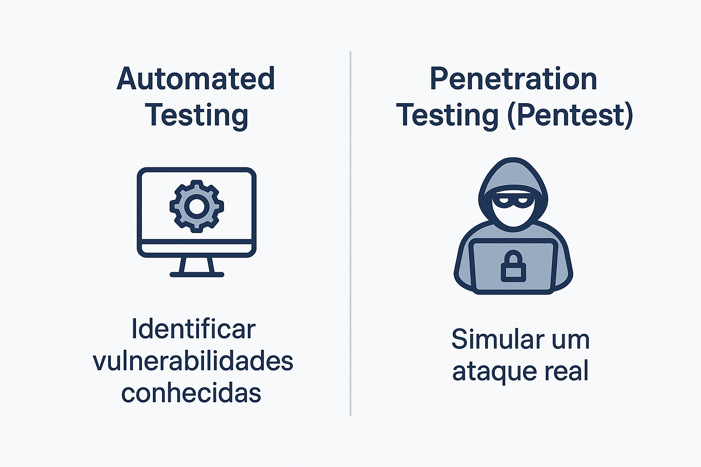

#  **Práticas de Testes de Software**

Os testes de software são fundamentais para garantir **qualidade, segurança e confiabilidade** de sistemas modernos.
Eles ajudam a detectar falhas antes que cheguem ao ambiente de produção e promovem a **cultura de qualidade contínua** dentro dos times de desenvolvimento.

---

##  1. **Testes Unitários**

Os **testes unitários** verificam pequenas partes isoladas do código — funções, métodos ou componentes — garantindo que se comportem conforme o esperado.

###  **Características**

* São rápidos e independentes.
* Cobrem o maior número possível de funções.
* Devem rodar automaticamente em pipelines CI/CD.

###  **Exemplo (Jest – JavaScript)**

```javascript
// calculadora.js
function somar(a, b) {
  return a + b;
}
module.exports = somar;

// calculadora.test.js
const somar = require('./calculadora');

test('deve somar dois números corretamente', () => {
  expect(somar(3, 5)).toBe(8);
});
```

 **Execução:**

```bash
npx jest calculadora.test.js
```

---

##  2. **Testes Automatizados de Interface (End-to-End)**

Os **testes automatizados de interface (E2E)** simulam o uso real do sistema.
Eles garantem que as telas, botões e fluxos principais funcionem corretamente após alterações de código.

###  **Características**

* Valida fluxos completos de navegação.
* Detecta regressões em interfaces.
* Ferramentas comuns: **Playwright**, **Cypress**, **Selenium**.

###  **Exemplo (Playwright – JavaScript)**

```javascript
const { test, expect } = require('@playwright/test');

test('usuário deve conseguir fazer login', async ({ page }) => {
  await page.goto('https://minhaaplicacao.com/login');
  await page.fill('#usuario', 'admin');
  await page.fill('#senha', '123456');
  await page.click('button[type=submit]');
  await expect(page).toHaveURL('https://minhaaplicacao.com/dashboard');
});
```

 **Execução:**

```bash
npx playwright test login.spec.js
```

---

## ⚡ 3. **Testes de Performance**

Os **testes de performance** medem a **resposta, estabilidade e escalabilidade** de um sistema sob carga.
Eles identificam gargalos e auxiliam na otimização de recursos.

###  **Características**

* Simulam múltiplos usuários simultâneos.
* Avaliam tempo médio de resposta, throughput e erros.
* Ferramentas: **Artillery**, **k6**, **JMeter**.

###  **Exemplo (Artillery – YAML)**

```yaml
config:
  target: "https://api.minhaaplicacao.com"
  phases:
    - duration: 60
      arrivalRate: 10
scenarios:
  - flow:
      - get:
          url: "/usuarios"
```

 **Execução:**

```bash
npx artillery run performance.yml
```

---

##  4. **Testes de Acessibilidade**

Os **testes de acessibilidade** garantem que a aplicação possa ser utilizada por todos — inclusive pessoas com deficiências visuais, motoras ou cognitivas.
Seguem padrões como **WCAG** e **WAI-ARIA**.

###  **Características**

* Avaliam contraste, texto alternativo, navegação por teclado.
* Podem ser integrados a testes automatizados.
* Ferramentas: **axe-core**, **Pa11y**, **Lighthouse**.

###  **Exemplo (axe-core + Playwright)**

```javascript
const { chromium } = require('playwright');
const AxeBuilder = require('@axe-core/playwright').default;

test('verificar acessibilidade da página inicial', async () => {
  const browser = await chromium.launch();
  const page = await browser.newPage();
  await page.goto('https://minhaaplicacao.com');

  const resultados = await new AxeBuilder({ page }).analyze();
  console.log('Violações encontradas:', resultados.violations);

  expect(resultados.violations.length).toBe(0);
  await browser.close();
});
```

 **Execução:**

```bash
npx jest acessibilidade.test.js
```

---

##  5. **Testes de Vulnerabilidade**

Os **testes de vulnerabilidade** verificam se o sistema apresenta falhas de segurança exploráveis, como:

* Injeções SQL e XSS,
* Exposição de dados sensíveis,
* Tokens inseguros,
* Dependências vulneráveis.

Esses testes podem ser **automatizados** com ferramentas integradas ao pipeline de CI/CD.

###  **Características**

* Analisam bibliotecas, APIs e endpoints.
* Geram relatórios de severidade (baixa, média, alta, crítica).
* Ferramentas: **OWASP ZAP**, **Snyk**, **npm audit**, **Burp Suite**.

###  **Exemplo (npm audit via Node.js)**

```javascript
const { exec } = require('child_process');

exec('npm audit --json', (err, stdout) => {
  const report = JSON.parse(stdout);
  console.log('Vulnerabilidades encontradas:', report.metadata.vulnerabilities);
});
```

 **Execução:**

```bash
node vulnerabilidade.js
```

---



## 🕵️ 6. **Testes de Penetração (Penetration Tests)**

Os **testes de penetração**, ou *Pentests*, são uma forma **avançada de teste de segurança manual**, cujo objetivo é **simular um ataque real** para identificar vulnerabilidades que possam resultar em **invasões, vazamentos de dados ou sequestro de sistemas**.

###  **Características**

* São executados por profissionais especializados (testers éticos).
* Utilizam técnicas de *hacking ético* e *engenharia social*.
* Diferem dos testes automatizados porque envolvem **análise contextual e comportamento humano**.
* Costumam seguir metodologias como **OWASP Testing Guide** ou **NIST SP 800-115**.

###  **Fases de um Pentest**

1. **Reconhecimento:** levantamento de informações sobre o alvo.
2. **Enumeração:** descoberta de serviços, portas e endpoints.
3. **Exploração:** tentativa controlada de exploração das falhas encontradas.
4. **Pós-exploração:** verificação de acesso a dados e persistência.
5. **Relatório:** detalhamento técnico e recomendações de correção.

###  **Exemplo prático (simples, ilustrativo)**

> Os Pentests normalmente não são codificados diretamente em JavaScript —
> mas ferramentas auxiliares podem ser escritas para **automatizar partes do processo**, como análise de headers HTTP ou respostas suspeitas:

```javascript
// scanner.js - exemplo simples de detecção de cabeçalhos inseguros
const axios = require('axios');

(async () => {
  const response = await axios.get('https://minhaaplicacao.com');
  const headers = response.headers;

  if (!headers['content-security-policy']) {
    console.warn('⚠️ Falta de Content-Security-Policy detectada!');
  }

  if (headers['x-powered-by']) {
    console.warn('⚠️ Cabeçalho "X-Powered-By" pode revelar tecnologia interna.');
  }
})();
```

 **Execução:**

```bash
node scanner.js
```

> Em contextos corporativos, pentests podem envolver ferramentas como **Metasploit**, **Burp Suite Pro**, **Kali Linux** e **OWASP ZAP**,
> combinadas a estratégias humanas de persuasão, *phishing* e manipulação de credenciais (*social engineering*).

---

##  **Resumo **

| Tipo de Teste            | Foco Principal                                 | Automação | Ferramentas Comuns                 |
| ------------------------ | ---------------------------------------------- | --------- | ---------------------------------- |
| Unitário                 | Funções e métodos isolados                     | Alta      | Jest, Mocha                        |
| Automatizado (UI/E2E)    | Fluxos de interface e navegação                | Alta      | Playwright, Cypress, Selenium      |
| Performance              | Carga e tempo de resposta                      | Alta      | Artillery, k6, JMeter              |
| Acessibilidade           | Inclusão e usabilidade                         | Média     | axe-core, Lighthouse, Pa11y        |
| Vulnerabilidade          | Falhas conhecidas e dependências inseguras     | Alta      | OWASP ZAP, Snyk, npm audit         |
| **Penetração (Pentest)** | Simulação real de invasão e vazamento de dados | **Baixa** | Metasploit, Burp Suite, Kali Linux |

---


Testes bem implementados transformam o ciclo de desenvolvimento em um **ambiente previsível, confiável e seguro**.
Automatização cobre grande parte das vulnerabilidades conhecidas, mas **somente o olhar humano de um Pentest** revela **falhas contextuais e comportamentais** que máquinas não percebem.

> **“Testar é desconfiar com método.”**
> — Uma boa suíte de testes é a maior garantia de estabilidade, segurança e confiança de um software moderno.

